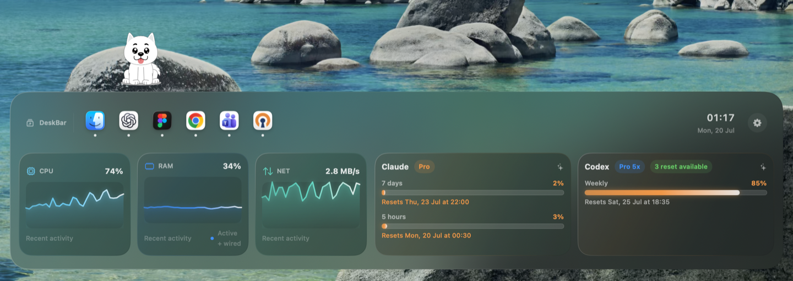

# DeskBar

DeskBar is a native macOS desktop companion that combines an app launcher, live system monitoring, AI usage limits, and a small animated pet in one Liquid Glass dashboard.



## Highlights

- Lives on the desktop layer instead of floating over other apps
- Launches and manages pinned macOS applications
- Charts CPU, active memory, and network activity
- Shows Codex and Claude capacity left, usage windows, plan labels, reset times, and a compact Notch status ribbon
- Includes configurable widgets, alerts, density, opacity, and launch-at-login settings
- Uses responsive Liquid Glass styling with sub-150 ms hover feedback
- Lets the Lottie white-dog companion play six click reactions and respects Reduce Motion

## Requirements

- macOS 14 or later
- Swift 6.1 toolchain or a compatible Xcode installation

## Build

WhiteDog animation JSON files are intentionally local-only and are not stored in
the public repository. Download the licensed files from the IconScout links in
`ASSET_PROVENANCE.md` and place all seven JSON files in `Resources/WhiteDog/`
before building. The build script checks for every required file and stops with
an actionable message if one is missing.

```bash
swift test
./scripts/build-app.sh release
open dist/DeskBar.app
```

The build script creates an ad-hoc signed app bundle at `dist/DeskBar.app` and embeds the required Lottie framework.

DeskBar source code is licensed under MIT. See `ASSET_PROVENANCE.md` for the
separate provenance status of the bundled WhiteDog animations and third-party Lottie framework.

To install the local build:

```bash
ditto dist/DeskBar.app /Applications/DeskBar.app
open -a DeskBar
```

## AI usage connections

DeskBar reads supported usage information from locally authenticated tools and stores local configuration in macOS preferences and Keychain. Authentication tokens and user-specific settings are not part of this repository.

## Project structure

```text
Sources/DeskBar/       SwiftUI and AppKit application code
Resources/WhiteDog/   Local-only Lottie animations (not tracked by Git)
Tests/DeskBarTests/   Unit tests
scripts/              App bundle build script
```

## Status

DeskBar is an early public build. The pet rests against the panel edge, plays a different one-shot reaction when clicked, and then returns to idle.
